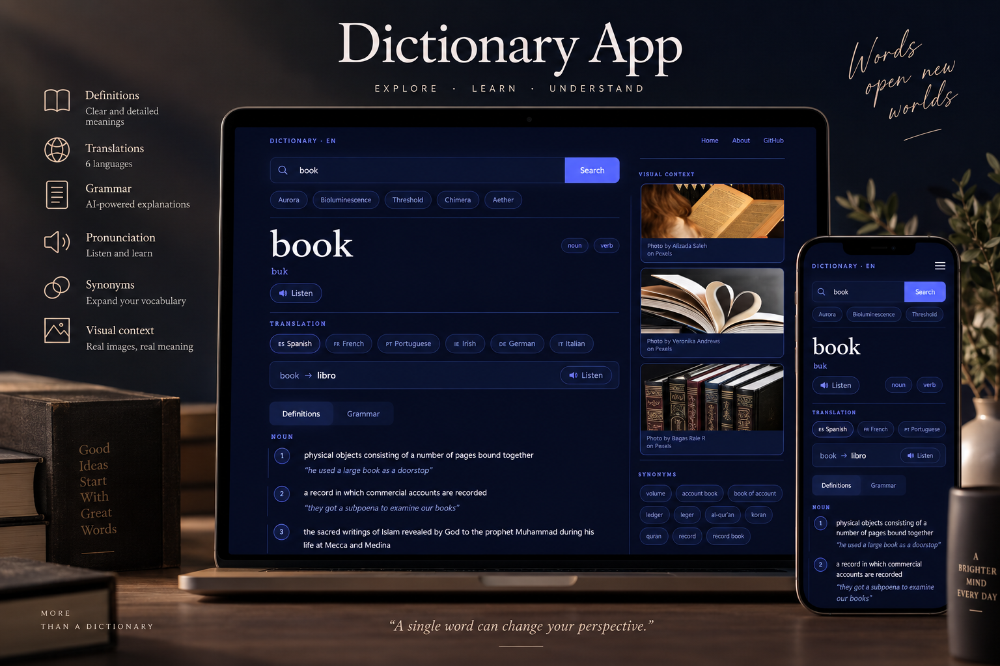

# Dictionary App

A modern English dictionary built with React, combining dictionary data, AI-powered grammar explanations, translations, pronunciation, synonyms and visual context.

## Live Demo

[View the live application](https://dictionary-by-pam-ortega.netlify.app)

## Screenshot



## About the Project

This project was built as part of the SheCodes React workshop.

The goal was to create a functional and responsive dictionary application using React and external APIs, while building a clean and modern user interface.

The application allows users to search for English words and explore their definitions, pronunciation, grammar, synonyms, translations and visual context.

## Features

- Search for English words
- Dictionary definitions organised by part of speech
- Up to five definitions displayed per part of speech
- Phonetic pronunciation
- Browser-based text-to-speech pronunciation
- AI-powered grammar explanations
- Translation into six languages:
  - Spanish
  - French
  - Portuguese
  - Irish
  - German
  - Italian
- Text-to-speech pronunciation for translations
- Language-specific pronunciation voices when available
- Clickable synonyms for further searches
- Visual context using relevant images
- Loading states
- Error handling
- Responsive design
- Modern dark UI
- Bootstrap and custom CSS styling

## Technologies

- React
- Vite
- JavaScript (ES6+)
- HTML
- CSS
- Bootstrap
- Bootstrap Icons
- SheCodes Dictionary API
- SheCodes AI API
- Pexels API
- Browser Speech Synthesis API

## Project Structure

```text
src/
├── components/
│   ├── Definitions.jsx
│   ├── Grammar.jsx
│   ├── Header.jsx
│   ├── SearchBar.jsx
│   ├── SuggestedWords.jsx
│   ├── Synonyms.jsx
│   ├── Translation.jsx
│   ├── VisualContext.jsx
│   └── WordHeader.jsx
│
├── services/
│   ├── aiApi.js
│   ├── dictionaryApi.js
│   └── pexelsApi.js
│
├── App.jsx
├── App.css
├── index.css
└── main.jsx

## API Integration

The application uses external APIs to provide dynamic content.

### SheCodes Dictionary API

The SheCodes Dictionary API provides the main dictionary data used throughout the application.

It is used for:

- Word definitions
- Parts of speech
- Phonetics
- Examples
- Synonyms

The dictionary results are dynamically rendered in React and organised by part of speech.

### SheCodes AI API

The SheCodes AI API is used for additional language-learning features.

It provides:

- Practical grammar explanations based on the searched word
- Translations into multiple languages

The grammar feature analyses the grammatical behaviour and practical English usage of the specific word and presents the information in a learner-friendly format.

The translation feature allows users to translate the searched English word into Spanish, French, Portuguese, Irish, German or Italian.

### Pexels API

The Pexels API is used to provide visual context for the searched word.

Relevant images are displayed in the Visual Context section to complement the dictionary information.

## Pronunciation

The application uses the browser's Speech Synthesis API for pronunciation.

The main searched word can be pronounced using the English language setting.

Translations can also be pronounced using language-specific settings for:

- Spanish
- French
- Portuguese
- Irish
- German
- Italian

Voice availability and quality may vary depending on the browser and operating system.

## Environment Variables

API keys are stored in environment variables and are not committed to the repository.

Create a `.env` file in the project root:

```env
VITE_SHECODES_API_KEY=your_dictionary_api_key
VITE_SHECODES_AI_API_KEY=your_ai_api_key
VITE_PEXELS_API_KEY=your_pexels_api_key

Making sure `.env` is included in `.gitignore`.

## What I Learned

This project helped me strengthen my understanding of React component-based development and working with external APIs.

I practised:

- Managing React state with `useState`
- Working with asynchronous API requests
- Passing data and functions between components using props
- Rendering dynamic content from API responses
- Handling loading and error states
- Working with multiple APIs in a single application
- Integrating AI-generated content into a React interface
- Using the browser Speech Synthesis API
- Creating reusable React components
- Building responsive layouts with Bootstrap and custom CSS
- Managing environment variables with Vite
- Structuring a React application into components and service modules
- Working with conditional rendering
- Handling API responses and errors
- Creating interactive UI elements
- Connecting user interactions with asynchronous API calls

## Future Improvements

Possible future improvements include:

- Saving favourite words
- Search history
- More advanced word usage examples
- Improved phrase and expression support
- Additional languages
- User accounts and personalised vocabulary lists

## Credits

Built as part of the SheCodes React workshop.

Designed and developed by Joice Pamela Ortega.